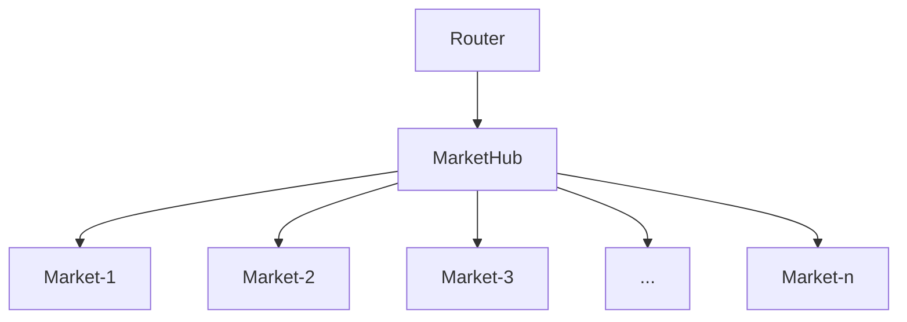

# High Level Architecture

## Core Contracts



Router authenticates and forwards user operations to MarketHub.

MarketHub receives user operations from Router, forward to the correct market contract, settle fees/payment, and check that accounts fulfill the margin requirements.

Market executes user operations from MarketHub, then returns payment amount and data for margin checking.

### Router

Router is the gateway to the Boros protocol. Its main functionality is authentication and authorization. Transactions can be sent to Router in two ways:

- Direct call where `msg.sender` is used as user address
- Agent call where user signs messages of desired operations
  - Only available to Pendle's permissioned relayers
  - Accessed through [Boros SDK](./Backend/SDK.md)

### MarketHub

MarketHub is the market coordinator and risk manager of Boros. MarketHub holds user deposits and keeps track of users in the system and the markets that they have entered. Users are identified by MarketAcc, a custom type made of:

- user EVM address
- subaccountID
  - Every user has up to 256 subaccounts, though only subaccount 0 is available to direct call
- tokenId
  - Every collateral token has a specific ID inside Boros. A given MarketAcc can only interact with markets of that collateral token.
- marketId
  - For isolated-margin account, this is the marketId of the market that this accounts operates on.
  - For cross-margin account, this is a special value _CROSS_, equal to $2^{24}-1$.

An account can enter a single market, if it is isolated, or multiple markets, if it is _CROSS_. Every market represents a different interest rate swap type: different token, different maturity, different reference rate. However, every market entered by a given account must share the same collateral token.

After each user operation, MarketHub checks that accounts fulfill the [margin requirements](./Mechanics/Margin.md).

### Market

Boros markets is deployed as separate contracts. Markets are differentiated by their descriptors:

```
- bool isIsolatedOnly
- TokenId tokenId
- MarketId marketId
- uint32 maturity
- uint8 tickStep
- uint16 iTickThresh
- uint32 latestFTime
```

Market provides an on-chain [central limit order book](./Mechanics/OrderBook.md), as well as over-the-counter (OTC) trading. For each user, market keeps track of position size and list of orders. When an order is filled, or an OTC trade is made, the position size is updated accordingly, and the fixed interest is paid upfront. Variable interest payments are paid on a fixed time period; the payment amount is determined by the accrual of the variable interest since last update, which is reported on-chain via an oracle.

### AMM

Automated Market Makers (AMM) provide continuous liquidity alongside the order book. In Boros, AMMs are like normal accounts: they don't have any special permissions except that they can perform OTC trades with users when requested. Router ensures optimal liquidity routing between AMMs and order book for best swap rate.

More details about AMM can be found in the [whitepaper](https://github.com/pendle-finance/boros-core-public/blob/main/whitepapers/AMM.pdf).

## Token Decimals

Internally, Boros uses 18-decimals fixed point for all numerical values, including position size, payment, fees, etc.

When depositing ERC20 tokens of non-18 decimals, the amount will be scaled up. Similarly, when withdrawing, the amount will be scaled down.

Tokens with decimal greater than 18 are not supported.
